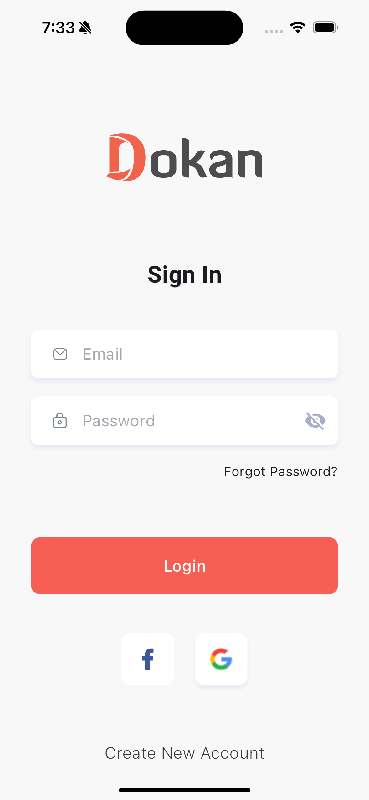
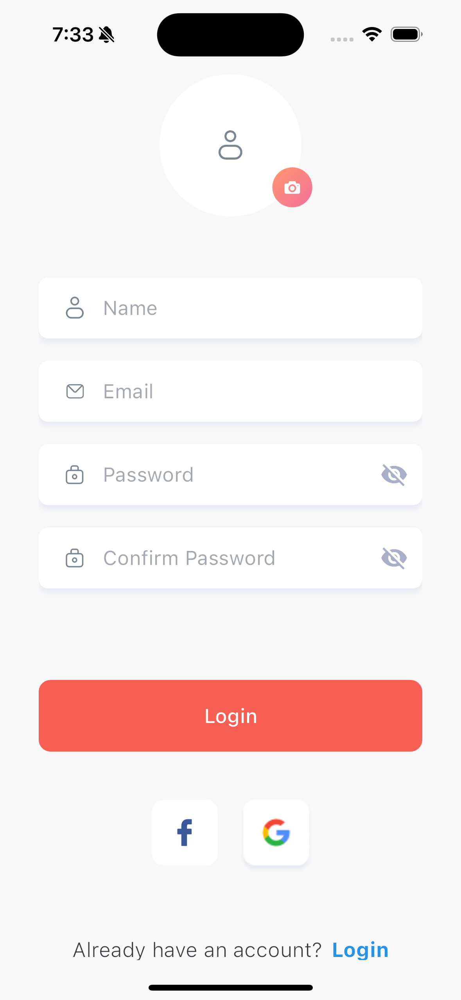
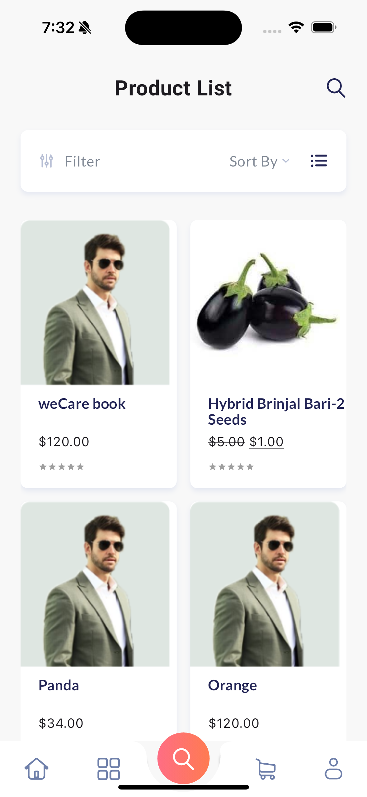
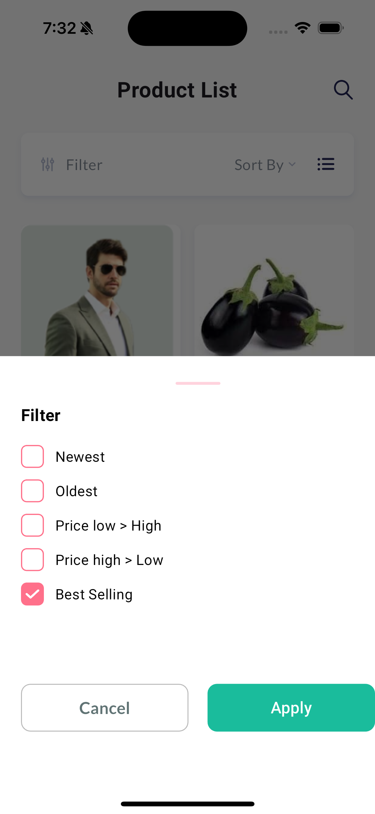
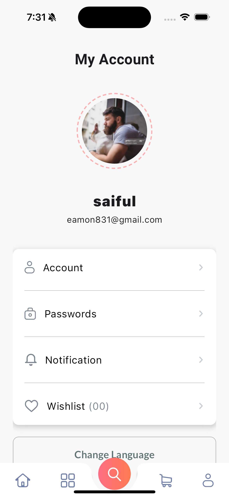
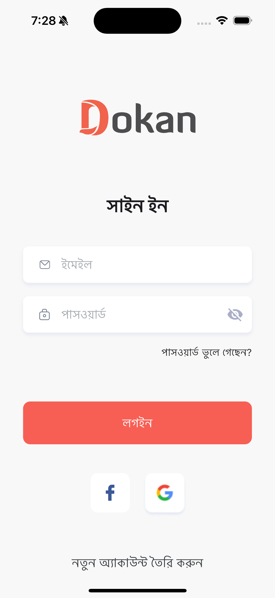
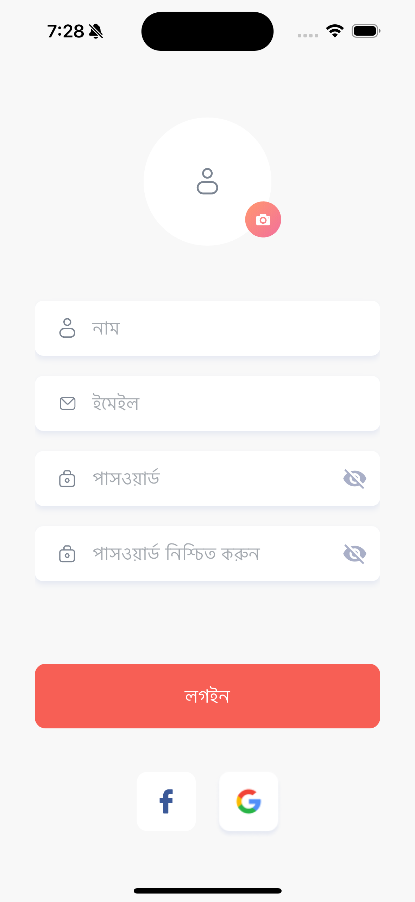
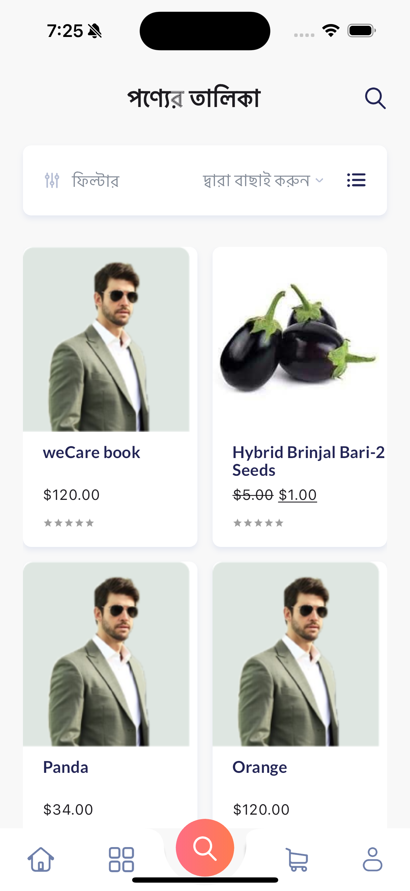
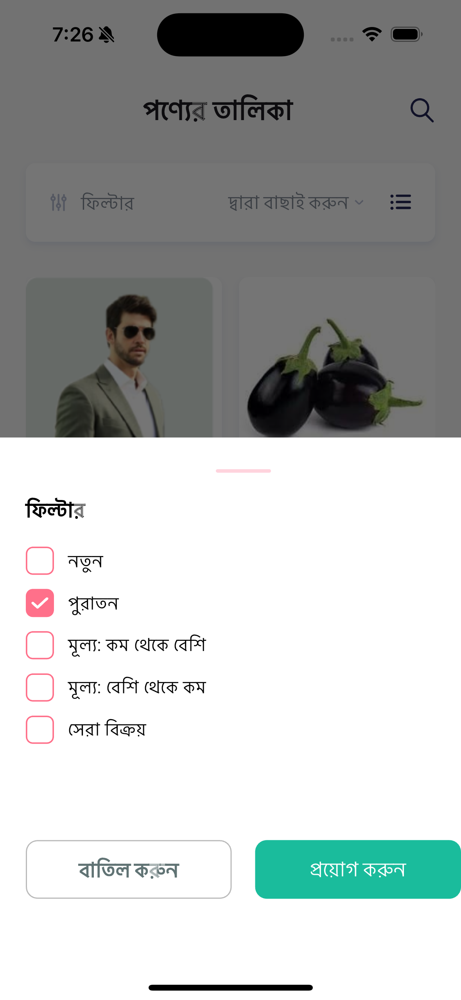
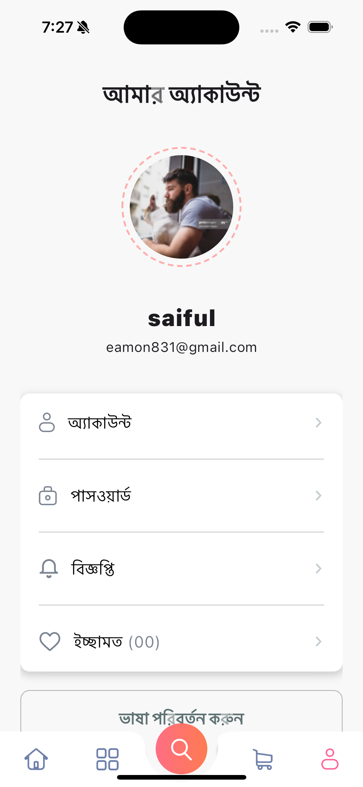

# weDevs Flutter Developer Hiring Test

## Overview

This Flutter project is part of the hiring process for weDevs. The goal of the project is to create a app for dokan wordpress plugin.

Modules:
- Sign In
- Sign Up
- Home
- Category
- Product List
- Cart
- Profile

## How to run the project
simply clone the project and run "flutter pub get" in the terminal on the root project directory
then run the project from the terminal by running the command "flutter run  lib/main_dev.dart or flutter run  lib/main_prod.dart"

# Tested on Android and iOS(only on simulator)

## Project Structure

The project follows a modular structure, and key components are organized as follows:

```bash
├── app
│   ├── bindings
│   │   └── initial_binding.dart
│   ├── core
│   │   ├── base
│   │   │   ├── base_controller.dart
│   │   │   ├── base_view.dart
│   │   │   ├── base_widget_mixin.dart
│   │   │   ├── mixins
│   │   │   │   ├── shorter_enum_mixin.dart
│   │   │   │   └── validator_mixin.dart
│   │   │   └── paging_controller.dart
│   │   ├── core_model
│   │   │   ├── logged_user.dart
│   │   │   ├── page_state.dart
│   │   │   └── page_status.dart
│   │   ├── loaders
│   │   │   ├── color_loader_2.dart
│   │   │   ├── color_loader_5.dart
│   │   │   └── loader_screen.dart
│   │   ├── utils
│   │   │   └── debouncer.dart
│   │   ├── values
│   │   │   ├── app_assets.dart
│   │   │   ├── app_colors.dart
│   │   │   ├── app_values.dart
│   │   │   └── text_styles.dart
│   │   └── widget
│   │       ├── app_bar_title.dart
│   │       ├── asset_image_view.dart
│   │       ├── base_button.dart
│   │       ├── custom_app_bar.dart
│   │       ├── dialog_pattern.dart
│   │       ├── elevated_container.dart
│   │       ├── icon_text_widgets.dart
│   │       ├── label_value.dart
│   │       ├── loading.dart
│   │       ├── paging_view.dart
│   │       ├── ripple.dart
│   │       └── text_form_field_widget.dart
│   ├── data
│   │   ├── local
│   │   │   ├── db
│   │   │   └── preference
│   │   │       ├── preference_manager.dart
│   │   │       └── preference_manager_impl.dart
│   │   └── remote
│   ├── model
│   │   ├── address.dart
│   │   ├── category.dart
│   │   ├── collection.dart
│   │   ├── dimensions.dart
│   │   ├── download.dart
│   │   ├── image_data.dart
│   │   ├── links.dart
│   │   ├── meta_data.dart
│   │   ├── product.dart
│   │   └── store.dart
│   ├── my_app.dart
│   ├── pages
│   │   ├── cart
│   │   │   ├── bindings
│   │   │   │   └── cart_binding.dart
│   │   │   ├── controllers
│   │   │   │   └── cart_controller.dart
│   │   │   └── views
│   │   │       └── cart_view.dart
│   │   ├── category
│   │   │   ├── bindings
│   │   │   │   └── category_binding.dart
│   │   │   ├── controllers
│   │   │   │   └── category_controller.dart
│   │   │   └── views
│   │   │       └── category_view.dart
│   │   ├── home
│   │   │   ├── bindings
│   │   │   │   └── home_binding.dart
│   │   │   ├── controllers
│   │   │   │   └── home_controller.dart
│   │   │   └── views
│   │   │       └── home_view.dart
│   │   ├── product_search
│   │   │   ├── bindings
│   │   │   │   └── product_search_binding.dart
│   │   │   ├── components
│   │   │   │   └── product_filter_bottom_sheet.dart
│   │   │   ├── controllers
│   │   │   │   └── product_search_controller.dart
│   │   │   └── views
│   │   │       └── product_search_view.dart
│   │   ├── profile
│   │   │   ├── bindings
│   │   │   │   └── profile_binding.dart
│   │   │   ├── controllers
│   │   │   │   └── profile_controller.dart
│   │   │   └── views
│   │   │       └── profile_view.dart
│   │   ├── root
│   │   │   ├── bindings
│   │   │   │   └── root_binding.dart
│   │   │   ├── controllers
│   │   │   │   ├── bottom_nav_controller.dart
│   │   │   │   └── root_controller.dart
│   │   │   ├── model
│   │   │   │   ├── menu_code.dart
│   │   │   │   └── menu_item.dart
│   │   │   └── views
│   │   │       ├── bottom_nav_bar.dart
│   │   │       └── root_view.dart
│   │   ├── sign_in
│   │   │   ├── bindings
│   │   │   │   └── sign_in_binding.dart
│   │   │   ├── controllers
│   │   │   │   └── sign_in_controller.dart
│   │   │   └── views
│   │   │       └── sign_in_view.dart
│   │   ├── sign_up
│   │   │   ├── bindings
│   │   │   │   └── sign_up_binding.dart
│   │   │   ├── controllers
│   │   │   │   └── sign_up_controller.dart
│   │   │   └── views
│   │   │       └── sign_up_view.dart
│   │   └── splash
│   │       ├── bindings
│   │       │   └── splash_binding.dart
│   │       ├── controllers
│   │       │   └── splash_controller.dart
│   │       └── views
│   │           └── splash_views.dart
│   ├── routes
│   │   ├── app_pages.dart
│   │   └── app_routes.dart
│   ├── service
│   │   ├── client
│   │   │   ├── api_options.dart
│   │   │   ├── error_catcher.dart
│   │   │   ├── network_error_widgets
│   │   │   │   ├── error_screen.dart
│   │   │   │   ├── no_internet_screen.dart
│   │   │   │   ├── not_found_screen.dart
│   │   │   │   ├── time_out_screen.dart
│   │   │   │   └── unmatched_data_type_screen.dart
│   │   │   ├── rest_client.dart
│   │   │   └── utils
│   │   │       ├── exception_message.dart
│   │   │       ├── failures.dart
│   │   │       └── pretty_dio_logger.dart
│   │   ├── endpoints.dart
│   │   └── services.dart
│   ├── session_manager
│   │   ├── prefs_keys.dart
│   │   └── session_manager.dart
│   └── shared_views
│       ├── account_view
│       │   ├── account_view.dart
│       │   └── account_view_controller.dart
│       └── product_card_view.dart
├── flavors
│   ├── build_config.dart
│   ├── env_config.dart
│   └── environment.dart
├── l10n
│   ├── app_bn.arb
│   └── app_en.arb
├── main_dev.dart
└── main_prod.dar
 ```
## State Management

This project uses **GetX** for state management. The relevant files are located in the `lib/app/core/base` directory:

- `base_controller.dart`: Controller for managing the state of the pages
- `base_view.dart`: Base view for the pages
- `base_widget_mixin.dart`: Mixin for common widgets
- `mixins`: Contains different mixins for the project
- `core_model`: Contains the page state and page status models and logged user model
- `pages`: Contains the different modules of the project
- `utils`: Contains utility modules and helper functions used across the app
- `values`: Contains the app colors, values, and text styles
- `widget`: Contains commonly used widgets across the app
- `model`: Contains the models used in the app
- `service`: Contains the API services used in the app
- `session_manager`: Contains the session manager used in the app
- `shared_views`: Contains the shared views used in the app

## Libraries Used

- **[get](https://pub.dev/packages/get)**: State management library for Flutter with a focus on simplicity and performance.
- **[nb_utils](https://pub.dev/packages/nb_utils)**: A package for common utility methods and widgets.
- **[dio](https://pub.dev/packages/dio)**: A powerful Http client for Dart, which supports Interceptors, Global configuration, FormData, Request Cancellation, File downloading, Timeout etc.
- **[flutter_svg](https://pub.dev/packages/flutter_svg)**: A package to render SVG files in Flutter.
- **[flutter_staggered_grid_view](https://pub.dev/packages/flutter_staggered_grid_view)**: A staggered grid view for Flutter.

## Features

- **Sign In**: Users can sign in to the app using their email and password.
- **Sign Up**: Users can sign up for the app using their email and password.
- **Home**: Home page is empty for now.
- **Category**: Category page is empty for now.
- **Product List**: Product list page where users can see the list of products. can filter the products by 5 different types filter.
- **Cart**: Cart page is empty for now.
- **Profile**: Profile page where users can see their profile information. user can update first name and last name.Change language from the profile page.


## Screenshots EN






## Screenshots BN







